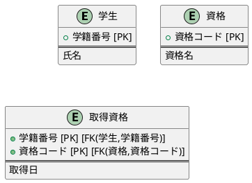

```puml
@startuml
entity "学生" {
  + 学籍番号 [PK]
  ==
  氏名
}
entity "資格" {
  + 資格コード [PK]
  ==
  資格名
}
entity "取得資格" {
  + 学籍番号 [PK] [FK(学生,学籍番号)]
  + 資格コード [PK] [FK(資格,資格コード)]
  ==
  取得日
}
@enduml
```
