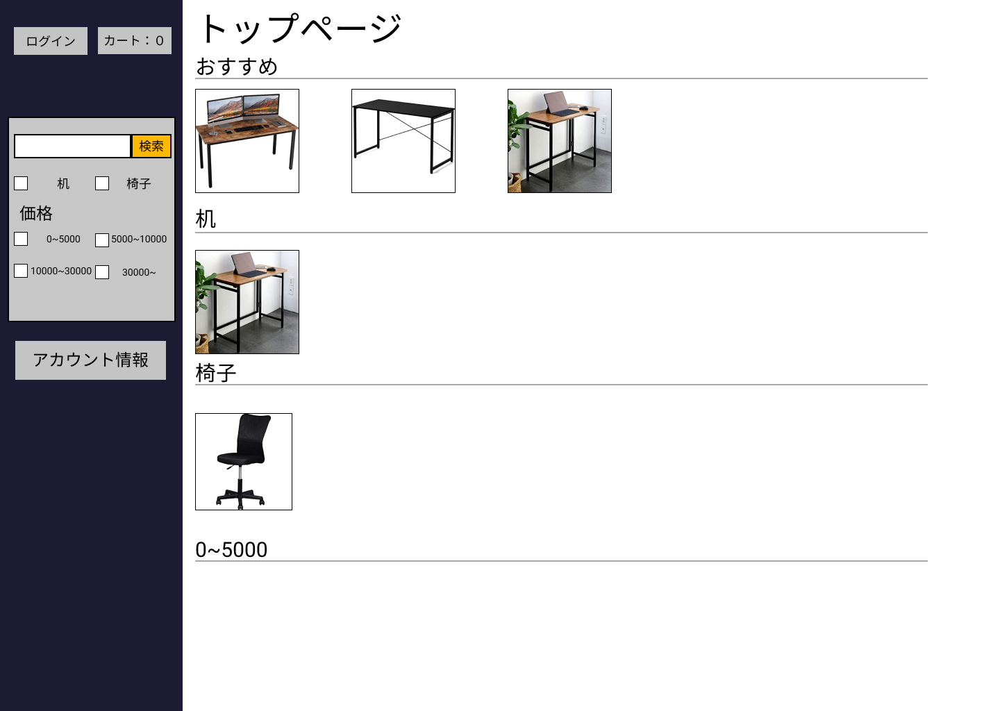

### 画面詳細図
## トップページ
### プロトタイプは以下のリンク先
[プロトタイプ](https://www.figma.com/file/ehNykJaNhrLFyaSn60GLLv/Untitled?node-id=0%3A1)
*****

*****
補足：対応DBの列はDB設計後、〇を対応するテーブル・カラム名に差しかえること。

| ID | 要素 | 内容 | アクション | イベント | 対応DB |
|----|------|------|-----------|----------|-------|
|1|バナー|サイト名表示|-|-|-|
|2|ログイン|サイト名表示|-|-|-|
|3|ID|入力欄|テキスト入力|-|〇|

